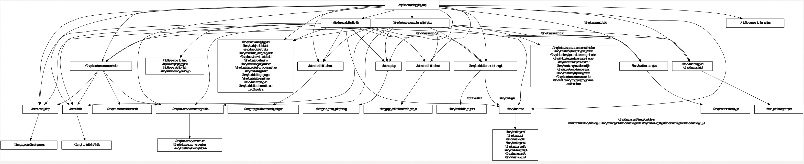

## 引言
Envoy是一款使用现代C++语言编写的L4/L7网络代理，采用Bazel进行依赖管理与执行编译过程。本文将以官方一个简单的HTTP Filter作为例子，分析Bazel在filter编译构建过程中所起的作用，为希望快速开始开发与编译filter的开发者提供指引，帮助大家快速了解envoy filter的编译流程。

## 一、Bazel简介

Bazel是一种类似CMake的用于组织编译过程的一个构建工具，类似Make，Maven和Gradle。其特点是可读性较好，支持跨语言，跨平台编译；并且可以定义代码库之间的依赖关系，支持跨代码库的联合构建。Bazel定义构建的依赖关系和规则，并管理构建生成的临时文件及二进制文件，具体的编译工作是调用各个语言的编译工具如gcc, javac等完成的。

这里简单介绍一下两个Bazel最重要的文件与相关概念：

### WORKSPACE

WORKSPACE文件，用于指定当前文件夹就是一个Bazel的工作区。工作区是一个存放了所有源代码和Bazel编译输出文件的目录，也就是整个项目的根目录，WORKSPACE文件总是存在于项目的根目录下。

### BUILD

一个或多个BUILD文件，用于告诉Bazel怎么构建项目的不同部分。如果工作区中的一个目录包含BUILD文件，那么它就是一个package。一个BUILD文件包含了几种不同类型的指令。其中最重要的是编译指令，它告诉Bazel如何编译想要的输出，比如可执行二进制文件或库。BUILD文件中的每一条编译指令被称为一个target。

接下来我们将开始分析Bazel在envoy-filter-example项目中的配置与作用，为了能够更好地阅读本文，希望大家已经有了Bazel的一些基础入门知识或者概念。关于Bazel的基础入门，可以参考一下两篇文章，看完了基本上就对Bazel有个总体了解了：
- Bazel官方示例解读（CSDN): https://blog.csdn.net/elaine_bao/article/details/78668657

 ## 二、Filter示例的目录结构

首先，我们从github上clone下来filter的示例代码，并拉取子模块：

```bash
git clone https://github.com/envoyproxy/envoy-filter-example.git
cd envoy-filter-example
git submodule update --init
```

从仓库中，我们来分析一下使用Bazel编译时主要的目录结构：

``` json
.
├── WORKSPACE // 指定该目录是一个Bazel工作区，文件内容告诉Bazel如何去得到其他的工程源供BUILD使用
├── BUILD // 描述如何构建根目录Package
├── .bazelrc // 对envoy/.bazelrc进行了引用
├── .bazelversion // 文件内容表示该工作区需要使用的Bazel版本
├── echo2.cc
├── echo2.h
├── echo2_config.cc
├── echo2_integration_test.cc
├── bazel // 仅包含了一个get_workspace_status文件，根据envoy/.bazelrc的描述，构建时将使用其生成--workspace_status_command参数的值
├── envoy // envoy源码作外部源被引入
│   ├── WORKSPACE // envoy目录也是一个Bazel工作区，文件内容告诉Bazel如何去得到其他的工程源供BUILD使用
│   ├── BUILD // 描述了envoy根目录的构建规则
│   ├── .bazelrc // 包含了大量预定义的在执行bazel build时的默认参数，以及自定义扩展参数的描述
│   ├── .bazelversion // 文件内容表示该工作区需要使用的Bazel版本
│   ├── bazel // 文件夹中包含了大量自定义的Bazel配置文件，使用类似于Python的Starlark语言编写，会被BUILD与WORKSPACE文件引用
└── http-filter-example // http filter的源码目录，工作区的一个Package
    ├── BUILD // 定义了http filter这个Package的构建规则
    ├── http_filter.cc
    ├── http_filter.h
    ├── http_filter.proto
    ├── http_filter_config.cc
    └── http_filter_integration_test.cc
 ```

## 三、WORKSPACE文件分析

envoy_filter_example的WORKSPACE文件与envoyproxy项目的WORKSPACE文件结构与内容大体一致，通过分析filter的WORKSPACE文件，我们也就明白envoy自身的工作区描述了。

```python
workspace(name = "envoy_filter_example") # 工作区名称

# 使用local_repository引入通过git submodule拉下来的envoy项目，并将项目命名为envoy，后续可通过@envoy进行引用
local_repository( 
    name = "envoy",
    path = "envoy",
)

# 从envoy的bazel/api_binding.bzl中读取envoy_api_binding符号
load("@envoy//bazel:api_binding.bzl", "envoy_api_binding")

# envoy_api_binding函数会注册@envoy_api与@envoy_api_canonical两个外部依赖，分别指向envoy/generated_api_shadow以及envoy/api。
# 通过对函数注释的解读，以及对源码的全局搜索，可见envoy源码中仅使用了@envoy_api依赖引用，而@envoy_api则由@envoy_api_canonical通过脚本进行生成，从而能在编译时过滤掉不在使用，而又正在开发或已经废弃的api
envoy_api_binding()

# 从envoy的bazel/api_repositories.bzl中读取envoy_api_dependencies符号
load("@envoy//bazel:api_repositories.bzl", "envoy_api_dependencies")

# envoy_api_dependencies函数定义了@envoy_api所需要的外部依赖
envoy_api_dependencies()

# 从envoy的bazel/repositories.bzl中读取envoy_dependencies符号
load("@envoy//bazel:repositories.bzl", "envoy_dependencies")

# envoy_dependencies函数载入了所有envoy编译需要的核心依赖，以及根据配置载入了需要编译进envoy的扩展的源码目标位置
envoy_dependencies()

# 从envoy的bazel/repositories_extra.bzl中读取envoy_dependencies_extra符号
load("@envoy//bazel:repositories_extra.bzl", "envoy_dependencies_extra")

# envoy_dependencies_extra函数载入了在envoy编译过程中所需要的工具，主要是一些python库和工具
envoy_dependencies_extra()

# 从envoy的bazel/dependency_imports.bzl中读取envoy_dependency_imports符号
load("@envoy//bazel:dependency_imports.bzl", "envoy_dependency_imports")

# envoy_dependency_imports函数载入了编译envoy时需要的bazel扩展功能，包括对不支持Bazel的第三方依赖支持、golang编译扩展、proto编译支持等
envoy_dependency_imports()
```

以上便是WORKSPACE文件内容的分析，它将整个项目所需要的底层依赖都进行了描述，使得每个Package中的BUILD文件都能够从这些底层依赖中直接引用相关库与工具，分离了依赖的引入与对依赖所执行的动作。


## 四、echo filter的BUILD文件分析

接下来，我们将看一下echo filter的BUILD文件内容，分析一下它的编译过程。

```python
# package函数修改了本Package规则的可见性，允许在其他Package中可以直接使用本Package的规则
package(default_visibility = ["//visibility:public"])

# load从在WORKSPACE中引入的@envoy依赖中加载envoy_cc_binary、envoy_cc_library与envoy_cc_test符号
load(
    "@envoy//bazel:envoy_build_system.bzl",
    "envoy_cc_binary",
    "envoy_cc_library",
    "envoy_cc_test",
)

# envoy_cc_binary是对Bazel自带的cc_binary的扩展函数
# 从函数定义中看出，envoy_cc_binary自动根据操作系统使用不同的linkopts连接参数、copts编译参数，以及添加默认依赖等
envoy_cc_binary(
    name = "envoy", 
    repository = "@envoy", # envoy_cc_binary自定义的参数，用于指定envoy的依赖名称，与WORKSPACE中的一致
    deps = [
        ":echo2_config",
        "@envoy//source/exe:envoy_main_entry_lib",
    ], # 编译依赖本项目的:echo2_config规则，以及@envoy中用于把main.cc编译为lib的规则
)

# envoy_cc_library是对Bazel自带的cc_library的扩展函数
# 与envoy_cc_binary一样，envoy_cc_library自动根据操作系统使用不同的copts编译参数、添加默认依赖、修改header路径前缀等功能；此外，它除了会生成一条同名的cc_library规则外，还会额外生成一条名为${name}_with_external_headers的cc_library规则，不同点在于使用了"nocompdb"的tag，用于供第三方项目引用envoy时使用。
envoy_cc_library(
    name = "echo2_lib", # echo2_lib规则用于filter逻辑实现代码部分的编译
    srcs = ["echo2.cc"], # 编译时直接使用的源代码文件
    hdrs = ["echo2.h"], # 编译时直接使用的头文件
    repository = "@envoy",
    deps = [
        "@envoy//include/envoy/buffer:buffer_interface",
        "@envoy//include/envoy/network:connection_interface",
        "@envoy//include/envoy/network:filter_interface",
        "@envoy//source/common/common:assert_lib",
        "@envoy//source/common/common:logger_lib",
    ], # 编译echo2_lib需要的envoy工作区依赖，此处不作展开
)

envoy_cc_library(
    name = "echo2_config", # echo2_config规则用于filter如何从配置中初始化filter，以及注册filter到envoy的代码部分的编译
    srcs = ["echo2_config.cc"],
    repository = "@envoy",
    deps = [
        ":echo2_lib",
        "@envoy//include/envoy/network:filter_interface",
        "@envoy//include/envoy/registry:registry",
        "@envoy//include/envoy/server:filter_config_interface",
    ],
)

# envoy_cc_test是对Bazel自带的cc_的扩展函数，与上述envoy_cc_binary功能类似，不再展开。
envoy_cc_test(
    name = "echo2_integration_test",
    srcs = ["echo2_integration_test.cc"],
    data =  ["echo2_server.yaml"],
    repository = "@envoy",
    deps = [
        ":echo2_config",
        "@envoy//test/integration:integration_lib"
    ],
)

# sh_test是Bazel自带的函数，允许编写一段Shell脚本进行测试
sh_test(
    name = "envoy_binary_test",
    srcs = ["envoy_binary_test.sh"], # 需要执行的Shell测试脚本
    data = [":envoy"], # 依赖的文件列表，此处依赖了编译生成的envoy二进制文件
)
```


## 五、http filter的BUILD文件分析

http filter的BUILD文件内容与上述echo filter的有相当一部分是相似的，而有少量新的规则出现在了http filter的BUILD中，下面主要分析一下新增的部分，对于其他类似的部分，参考上述对echo filter的分析即可。

http filter新增的规则，主要体现在对于filter的proto描述文件的处理上，包括转换为cc文件、对转换后的文件进行编译等动作。

```python
package(default_visibility = ["//visibility:public"]) # 参考echo filter部分

load(
    "@envoy//bazel:envoy_build_system.bzl",
    "envoy_cc_binary",
    "envoy_cc_library",
    "envoy_cc_test",
) # 参考echo filter部分

# 从envoy的bazel/api_build_system.bzl中读取api_proto_package符号
load("@envoy_api//bazel:api_build_system.bzl", "api_proto_package")

envoy_cc_binary(
    name = "envoy",
    repository = "@envoy",
    deps = [
        ":http_filter_config",
        "@envoy//source/exe:envoy_main_entry_lib",
    ],
) # 参考echo filter部分

# 执行api_proto_package函数，该函数会对proto文件转换为cc文件，下一个模块我们将对本函数进行分析
api_proto_package()

# http_filter_lib规则与上面的echo_lib规则相似，区别在于依赖了本Package的:pkg_cc_proto，而放眼整个BUILD文件，确找不到一个名为pkg_cc_proto的规则，我们将与上述api_proto_package()函数一起分析。
envoy_cc_library(
    name = "http_filter_lib",
    srcs = ["http_filter.cc"],
    hdrs = ["http_filter.h"],
    repository = "@envoy",
    deps = [
        ":pkg_cc_proto",
        "@envoy//source/exe:envoy_common_lib",
    ],
)

envoy_cc_library(
    name = "http_filter_config",
    srcs = ["http_filter_config.cc"],
    repository = "@envoy",
    deps = [
        ":http_filter_lib",
        "@envoy//include/envoy/server:filter_config_interface",
    ],
) # 参考echo filter部分

envoy_cc_test(
    name = "http_filter_integration_test",
    srcs = ["http_filter_integration_test.cc"],
    repository = "@envoy",
    deps = [
        ":http_filter_config",
        "@envoy//test/integration:http_integration_lib",
    ],
) # 参考echo filter部分
```

对于http filter的BUILD文件，我们将重点放在api_proto_package()这个函数中，接下来将分析一下与这个函数相关的自定义规则，梳理一下它的作用于执行过程。

```python
# 下文中主要需要关注的外部规则
load("@com_envoyproxy_protoc_gen_validate//bazel:pgv_proto_library.bzl", "pgv_cc_proto_library")
load("@com_github_grpc_grpc//bazel:cc_grpc_library.bzl", "cc_grpc_library")
load("@rules_proto//proto:defs.bzl", "proto_library")
# load more rules...

# 定义了一些字符串常量，方便后续使用
_PY_PROTO_SUFFIX = "_py_proto"
_CC_PROTO_SUFFIX = "_cc_proto"
_CC_GRPC_SUFFIX = "_cc_grpc"
_GO_PROTO_SUFFIX = "_go_proto"
_GO_IMPORTPATH_PREFIX = "github.com/envoyproxy/go-control-plane/"

# api_proto_package定义了对于作为envoy api的proto将如何进行转换与编译，提供了c++、python以及golang相关的规则描述
def api_proto_package(
        name = "pkg", # 默认名称为pkg
        srcs = [],
        deps = [],
        has_services = False,
        visibility = ["//visibility:public"]):
    if srcs == []:
        srcs = native.glob(["*.proto"]) # 默认src文件为Package目录下的所有*.proto文件

    name = "pkg" # 这里强制令name赋值为pkg
    # 调用api_cc_py_proto_library来生成proto的c++与python规则。由于pkg与srcs默认值的存在，开发者能够简单的调用api_proto_package()即可。
    api_cc_py_proto_library(
        name = name,
        visibility = visibility,
        srcs = srcs,
        deps = deps,
        has_services = has_services,
    )
    
    # compilers用于指定proto转换为go文件的工具，用于生成pb.go以及pb.validate.go
    compilers = ["@io_bazel_rules_go//proto:go_proto", "@envoy_api//bazel:pgv_plugin_go"]
    if has_services:
        compilers = ["@io_bazel_rules_go//proto:go_grpc", "@envoy_api//bazel:pgv_plugin_go"]

    # go_proto_library用于定义proto转换为golang代码的相关规则，envoy自身编译过程中并不依赖这些go library，主要被使用在测试与控制平面项目中。
    go_proto_library(
        name = name + _GO_PROTO_SUFFIX, # 默认为pkg_go_proto
        compilers = compilers,
        importpath = _GO_IMPORTPATH_PREFIX + native.package_name(), # 修改生成的go文件的import路径，使得生成的文件import路径的仓库变为github.com/envoyproxy/go-control-plane，使其在对应仓库中能够使用go module正确引用
        proto = name,
        visibility = ["//visibility:public"],
        deps = [_go_proto_mapping(dep) for dep in deps] + [
            "@com_github_golang_protobuf//ptypes:go_default_library",
            "@com_github_golang_protobuf//ptypes/any:go_default_library",
            "@com_github_golang_protobuf//ptypes/duration:go_default_library",
            "@com_github_golang_protobuf//ptypes/struct:go_default_library",
            "@com_github_golang_protobuf//ptypes/timestamp:go_default_library",
            "@com_github_golang_protobuf//ptypes/wrappers:go_default_library",
            "@com_envoyproxy_protoc_gen_validate//validate:go_default_library",
            "@com_google_googleapis//google/api:annotations_go_proto",
            "@com_google_googleapis//google/rpc:status_go_proto",
        ], # 若干依赖，包含了api proto文件中import的第三方依赖，比如googleapis等，此处不作深入分析
    )

# api_cc_py_proto_library定义了对proto文件转换为cc以及python文件，以及编译为c++目标文件的规则
def api_cc_py_proto_library(
        name,
        visibility = ["//visibility:private"],
        srcs = [],
        deps = [],
        linkstatic = 0,
        has_services = 0):
    relative_name = ":" + name
    # 使用Bazel自定义的proto_library规则来定义一个对应的proto规则，并添加了默认依赖
    proto_library(
        name = name,
        srcs = srcs,
        deps = deps + _COMMON_PROTO_DEPS, # _COMMON_PROTO_DEPS包含了@com_google_protobuf、@com_google_googleapis以及@com_envoyproxy_protoc_gen_validate等依赖
        visibility = visibility,
    )
    cc_proto_library_name = name + _CC_PROTO_SUFFIX # _CC_PROTO_SUFFIX=_cc_proto"
    # pgv_cc_proto_library函数是从https://github.com/envoyproxy/protoc-gen-validate项目中引入的规则（内容见：https://github.com/envoyproxy/protoc-gen-validate/blob/v0.4.0/bazel/pgv_proto_library.bzl#L25），它根据依赖的proto_library转换出对应的*.pb.h/*.pb.cc以及*.pb.validate.h/*.pb.validate.cc文件，同时编译出对应的目标文件
    pgv_cc_proto_library(
        name = cc_proto_library_name, # 由于api_proto_package的name参数默认值为pkg，因此这里的name默认就是pkg_cc_proto了
        linkstatic = linkstatic,
        cc_deps = [_cc_proto_mapping(dep) for dep in deps] + [
            "@com_google_googleapis//google/api:http_cc_proto",
            "@com_google_googleapis//google/api:httpbody_cc_proto",
            "@com_google_googleapis//google/api:annotations_cc_proto",
            "@com_google_googleapis//google/rpc:status_cc_proto",
        ],
        deps = [relative_name],
        visibility = ["//visibility:public"],
    )
    
    # _api_py_proto_library函数为proto描述定义了python转换方式，规则名称为${name}_py_proto，默认为pkg_py_proto，envoy自身编译时并未用到python相关的proto转换，主要用于附带的开发与测试工具使用
    _api_py_proto_library(name, srcs, deps)

    # 如果这个proto描述包含Service定义，则使用_api_cc_grpc_library(底层为cc_grpc_library)对grpc相关代码进行生成
    if has_services:
        cc_grpc_name = name + _CC_GRPC_SUFFIX
        cc_proto_deps = [cc_proto_library_name] + [_cc_proto_mapping(dep) for dep in deps]
        _api_cc_grpc_library(name = cc_grpc_name, proto = relative_name, deps = cc_proto_deps)
```

从以上分析可以看出，api_proto_package()函数巧妙的通过默认值，自动的把BUILD所在目录下的所有proto文件都整合到了:pkg_cc_proto、:pkg_py_proto以及:pkg_go_proto当中了，因此在BUILD文件后续的代码中，名为http_filter_lib的envoy_cc_library就直接对:pkg_cc_proto进行了依赖，而这个依赖是通过api_proto_package()自动生成的，这解析了为什么在BUILD文件中并没有定义:pkg_cc_proto而却可以直接引用依赖的原因了。

## 六、有用的Bazel命令

### bazelisk工具

bazelisk是基于Go语言编写的Bazel启动器，它会为你的工作区下载最适合的Bazel，并且透明的将命令转发给该Bazel。通常通过.bazelversion文件内容来描述当前工作区所需要的Bazel版本号，如3.1.0。

关于如何安装，可参考官方仓库：https://github.com/bazelbuild/bazelisk

### 生成项目依赖图

通过Bazel，我们可以方便的生成整个项目的依赖关系图，帮助我们快速了解项目。

下面，我们继续以envoy的http-filter-example为例，介绍如何生成这样的依赖图。

```bash
cd envoy-filter-example
# 这里我们直接使用bazelisk代替bazel命令
# 生成graphviz文件。注意deps()中，我们把深度定为了2，能够较好的体现出依赖关系，如果使用3或更高的深度，依赖图会变得不可读，甚至无法生成，大家可以尝试一下。
bazelisk query --nohost_deps --noimplicit_deps 'deps(//http-filter-example:http_filter_config, 2)'  --output graph > http-filter-example-deps.dot
# 使用xdot工具查看依赖关系图(https://pypi.org/project/xdot/)
xdot http-filter-example-deps.dot
```

生成的依赖图：


此外，我们也可以直接将生成的.dot文件的内容粘贴到在线graphviz网站中生成依赖图：http://www.webgraphviz.com/

### 开发过程中生成proto的c++代码

通过上文对于api_proto_package()函数的分析，我们已经清楚了BUILD文件中是如何对proto文件转换为c++等语言文件的。熟悉了这个规则之后，我们便可以直接使用bazel来生成一些中间代码，而无需手撸protoc命令或者每次都编译可执行文件了。

```bash
cd envoy-filter-example
# 生成当前package下*.proto对应的c++代码
bazelisk build //http-filter-example:pkg_cc_proto
# 生成的代码被放在如下目录，c++代码生成后，vscode等编辑器便能够准确地找到函数符号，正确的进行转跳了
ls -l bazel-bin/http-filter-example | grep pb
# -r-xr-xr-x  1 derekghchen  wheel   13843 Jul 12 21:53 http_filter.pb.cc
# -r-xr-xr-x  1 derekghchen  wheel   13245 Jul 12 21:53 http_filter.pb.h
# -r-xr-xr-x  1 derekghchen  wheel    1874 Jul 12 21:53 http_filter.pb.validate.cc
# -r-xr-xr-x  1 derekghchen  wheel     500 Jul 12 21:53 http_filter.pb.validate.h
```

同理，我们也用bazel build命令，将proto转换为golang代码：

```bash
# 构建pkg_go_proto目标，生成golang代码文件
bazelisk build //http-filter-example:pkg_go_proto
# 查看生成的golang文件
ls -l bazel-bin/http-filter-example/pkg_go_proto_/github.com/envoyproxy/go-control-plane/http-filter-example        
# -r-xr-xr-x  1 derekghchen  wheel  5503 Jul 12 22:01 http_filter.pb.go
# -r-xr-xr-x  1 derekghchen  wheel  2500 Jul 12 22:01 http_filter.pb.validate.go
``` 

## 七、总结

本文通过对官方envoy-filter-example的Bazel编译配置脚本进行分析，解释了envoy filter开发编译过程中的一些关键配置与依赖关系，帮助大家快速了解自定义filte被编译进envoy的过程。最后，介绍了几个有用的工具以及指令，以期帮助大家提高开发效率。同样希望对envoy filter编译配置的分析，令大家对Bazel有更多的了解与思考。