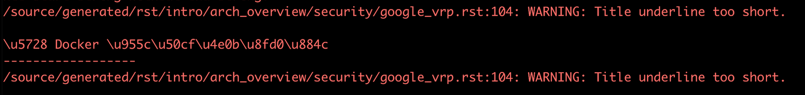
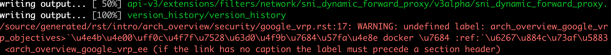

# Envoy 常见编译问题

### 本地文档编译

由于 Envoy 官网文档的特殊性，此次翻译没有用 `netlify` 设置翻译预览，因此需要大家在本地翻译结束后，使用如下命令来进行本地文档构建，以确定翻译文档的格式是否有问题：

```text
cd envoy/
./ci/run_envoy_docker.sh 'docs/build.sh'
```

常见的编译问题大概有以下几种，可参考进行修改。

#### 1 汉语下面的下划线长度不能小于汉语长度

正确示例如下：

```text
Google 漏洞奖励计划（VRP）
=======================
```

错误示例如下：

```text
Google 漏洞奖励计划（VRP）
==============
```

如用上述错误示例翻译，则在编译时候会出现如下错误：



#### 2 超链接前后需要加空格

正确示例如下：

```text
:ref:`威胁模型 <arch_overview_google_vrp_threat_model>` 保持一致。
```

请注意符号 ````` 和保持两个汉字之间须加一个空格。

错误示例如下：

```text
:ref:`威胁模型 <arch_overview_google_vrp_threat_model>`保持一致。
```

如按照上述错误示例翻译，会出现如下所示的错误：



#### 3 `rst` 的链接内容可不用翻译

如下内容，只需要将  `Observability` 翻译为**`观测性`**即可，其他内容（如 `statistics` ）不用翻译，否则会编译失败。

```text
Observability
=============

.. toctree::
  :maxdepth: 2

  statistics
  application_logging
  access_log/access_log.rst
```

正确翻译示例如下：

```text
观测性
======

.. toctree::
  :maxdepth: 2

  statistics
  application_logging
  access_log/access_log.rst
```

错误翻译示例：

```text
观测性
=============

.. toctree::
  :maxdepth: 2

  统计
  application_logging
  access_log/access_log.rst
```

