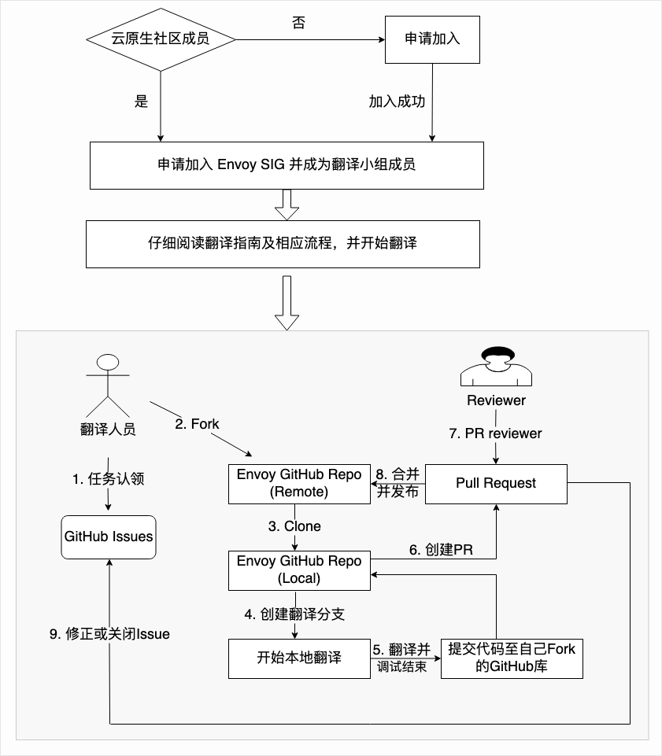

# Envoy 中文翻译流程

### 前提条件：

1 熟悉 GitHub 操作流程（Fork [翻译主库](https://github.com/cloudnativeto/envoy) 至个人 GItHub 账号下，clone 仓库至本地，翻译相关文件，然后 push 翻译代码至自己仓库，最后从个人仓库向 GitHub 提 PR）。详情可查看[翻译流程图示](https://github.com/cloudnativeto/envoy/blob/zh/docs/root/img/envoy-trans.png)。

2 对 Envoy 所有了解

### 加入翻译团队

1 加入云原生社区 Envoy SIG，详细信息参考[加入 Envoy SIG](https://wj.qq.com/s2/7279251/7934)

2 在[这儿](%20https://docs.qq.com/sheet/DYVJpRFdKbUVnQUZV?tab=BB08J2%20)登记自己的信息

### 开始翻译

翻译前请认真阅[读翻译指南](%20https://github.com/cloudnativeto/envoy/tree/zh/docs/root)：

1 在 [cloudnativeto/envoy](https://github.com/cloudnativeto/envoy) 库的  [issue](https://github.com/cloudnativeto/envoy/issues) 中认领自己想翻译的 issue，然后在comment中输入 `/accept`。

2 翻译完毕，提PR至 [cloudnativeto/envoy](https://github.com/cloudnativeto/envoy/) 仓库，同时输入 `/pushed` 指令修改 issue 的状态

3 待 PR 被 merge 之后，请输入 `/merged` 指令关闭对应的翻译issue

4 认领下一个人任务，开始翻译

整体的翻译流程可以参考下图：

### 加入 Review 团队（Optional）

为了把控 Envoy 的翻译质量，我们成立了专门的 Envoy Review 团队，每一个 PR 都需要至少两位 Reviewer 通过才可以关闭，如果你想加入 Review 团队，一起把关 Envoy 翻译的质量，欢迎加入我们，可在 Envoy SIG 微信群里面，发微信给 Jimmy 或者 我（小马哥）。经过面试后，我们会拉你入群。

